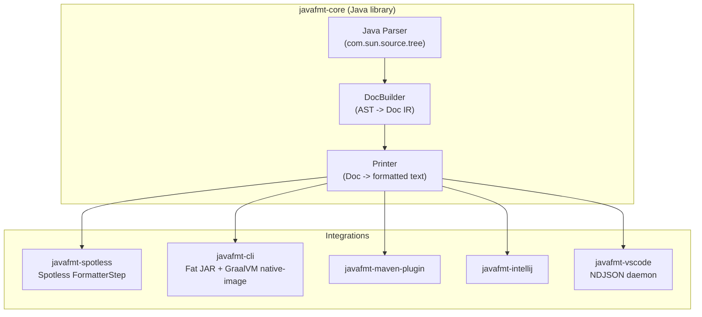

# Architecture

This document covers how javafmt is built. For *what* it enforces, see [docs/rules.md](docs/rules.md). For the user-facing comparison, see [docs/rubric.md](docs/rubric.md). For phased delivery and open questions, see [ROADMAP.md](ROADMAP.md).

## Pipeline




## Why this shape

- **`javac`'s own parser** (`com.sun.source.tree`) means we never trail the language. New LTS ships -> bump the JDK dep -> the new constructs are already there.
- **Spotless integration** is a thin wrapper. Spotless already supports custom `FormatterStep` implementations and most Java projects on Gradle use it, so it's the shortest path to adoption.
- **GraalVM native-image** is best-effort. `com.sun.source.tree` uses service loading and reflection internally, so native-image needs reflection hints (collected via the tracing agent and committed under `META-INF/native-image/`). If native-image ever stops being viable, the fat JAR CLI is the fallback — still fast, just needs a JVM installed.
- **The Maven plugin** ships `javafmt:format` and `javafmt:check` goals with `javafmt-core` embedded. Add it to `pom.xml` and it works. No external tools, no pre-installation. Critical for the rubric's "anything not enforced by CI is merely a suggestion" complaint.
- **The VS Code extension** talks NDJSON over stdin/stdout to a long-lived daemon, so editor-side formatting doesn't pay JVM cold-start on every keystroke. The daemon ships as a GraalVM native binary with a fat-JAR fallback.
- **A shared core** means every integration produces identical output. There is exactly one formatter.

## Intermediate representation: Doc algebra

The core uses a [Wadler-Lindig document algebra](https://homepages.inf.ed.ac.uk/wadler/papers/prettier/prettier.pdf) — the same trick behind Prettier, rustfmt, and dprint. It's what makes the layout fast and predictable.

### Primitives

| Doc node       | Meaning                                                        |
|----------------|----------------------------------------------------------------|
| `Text(s)`      | Literal string, never broken                                   |
| `Line`         | Line break, or a space if the group is flattened               |
| `SoftLine`     | Line break, or nothing if the group is flattened               |
| `HardLine`     | Always breaks                                                  |
| `Indent(d)`    | Bumps indent for its contents                                  |
| `Group(d)`     | Try to flatten on one line; break if it doesn't fit            |
| `Concat(ds)`   | Sequence of docs                                               |
| `IfBreak(b,f)` | `b` when the enclosing group breaks, `f` when it stays flat    |

The Wadler-Lindig algorithm runs in **O(n)** with line width as a constant factor. Paired with `javac`'s heavily-optimized parser, formatting is competitive with or faster than google-java-format.

## Module layout

```
javafmt/
├── build.gradle.kts             # root: jreleaser + axion-release
├── settings.gradle.kts          # includes all subprojects
├── gradle/
│   └── libs.versions.toml       # version catalog (single source of truth)
├── buildSrc/
│   └── src/main/kotlin/
│       ├── javafmt.java-conventions.gradle.kts     # Java 21 toolchain, errorprone, NullAway
│       ├── javafmt.publish-conventions.gradle.kts  # POM metadata + signing
│       ├── javafmt.native-conventions.gradle.kts   # GraalVM native-image + Docker Linux cross-compile
│       └── javafmt.npm-conventions.gradle.kts      # Node tasks for TypeScript modules
│
├── javafmt-core/                # parser + formatter (zero runtime deps beyond slf4j-api)
├── javafmt-cli/                 # standalone CLI (fat JAR + GraalVM native binary per platform)
├── javafmt-spotless/            # Spotless FormatterStep
├── javafmt-maven-plugin/        # Maven plugin (javafmt:format, javafmt:check)
├── javafmt-intellij/            # IntelliJ IDEA plugin (ExternalFormatProcessor)
├── javafmt-vscode/              # VS Code extension + NDJSON daemon
│
├── website/                     # Docusaurus site (deployed to https://javafmt.io)
├── docs/                        # user-facing markdown (served by Docusaurus, also browsable on GitHub)
└── ARCHITECTURE.md              # this file
```

## Build conventions

The `javafmt.java-conventions` plugin in `buildSrc` applies to every JVM submodule and sets:

- Java 21 toolchain
- JUnit 5 (BOM-pinned) and AssertJ
- `errorprone` plus `nullaway` (`NullAway` set to `ERROR` for `io.javafmt`)
- `-Werror`, `-Xlint:all` minus `-processing`
- Lombok and JSpecify as `compileOnly` — annotation processors only, no runtime dep

Integration modules layer additional convention plugins on top as needed (`publish-conventions` for Maven Central artifacts, `native-conventions` for GraalVM-built modules, `npm-conventions` for TypeScript modules).

## Dependency management

- The version catalog at `gradle/libs.versions.toml` is the only place JVM dependency versions live. No inline versions anywhere.
- `javafmt-core` keeps runtime deps to a minimum — `slf4j-api` and nothing else. Every new dep needs a clear justification.
- Integration modules depend on `javafmt-core` and add only their own integration-specific deps.

## Technology choices

| Concern        | Choice                                     | Why                                                                          |
|----------------|--------------------------------------------|------------------------------------------------------------------------------|
| Language       | Java 21+                                   | Dogfooding the same target. Also: access to `com.sun.source.tree`.            |
| Build tool     | Gradle (Kotlin DSL)                        | Standard for Java; both Spotless and node-gradle integrate cleanly.           |
| Parser         | `com.sun.source.tree`                      | Always current with the JDK. Zero dependencies.                               |
| Doc algebra    | Custom (sealed interfaces + records)       | Lightweight, no deps, and showcases modern Java.                              |
| Native binary  | GraalVM native-image                       | Fast startup. Fat JAR is the fallback if native ever proves too painful.      |
| Testing        | JUnit 5 + AssertJ + fixture files          | Input/expected pairs are easy to maintain. `@ParameterizedTest` over loops.   |
| CI             | GitHub Actions                             | Multi-OS GraalVM builds. JReleaser handles deploy.                            |

## Code style

For the formatter's own Java code, see the rules in [CLAUDE.md](CLAUDE.md). It's the same modern-Java palette javafmt enforces on other projects — records, sealed interfaces, pattern matching, `final var`, `Optional`, AssertJ.
