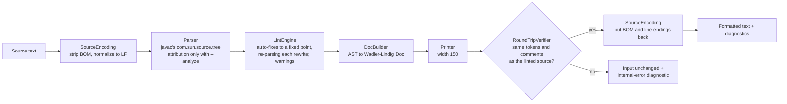
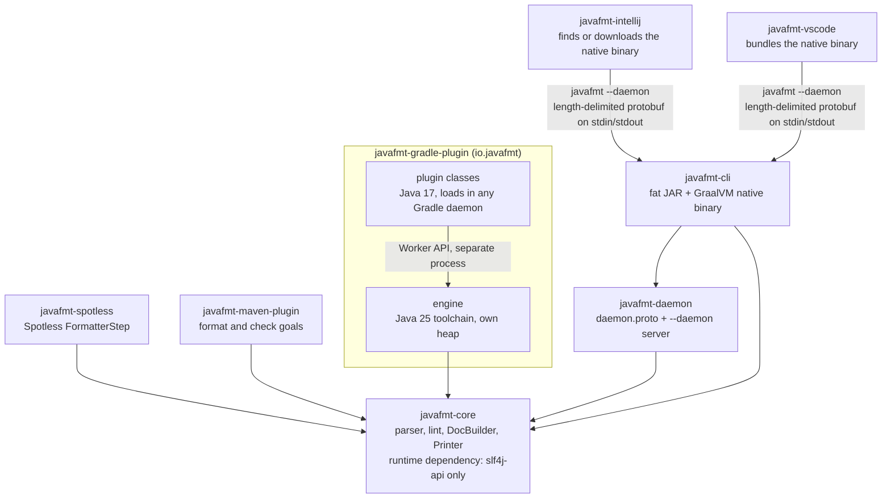

# Architecture

What javafmt enforces is in [docs/rules.md](docs/rules.md), and why in [docs/intro.md](docs/intro.md#why-javafmt).

## Formatting one file

```mermaid
flowchart LR
    src["Source text"] --> enc["SourceEncoding<br/>strip BOM, normalize to LF"]
    enc --> parse["Parser<br/>javac's com.sun.source.tree<br/>attribution only with --analyze"]
    parse --> lint["LintEngine<br/>auto-fixes to a fixed point,<br/>re-parsing each rewrite; warnings"]
    lint --> build["DocBuilder<br/>AST to Wadler-Lindig Doc"]
    build --> print["Printer<br/>width 150"]
    print --> verify{"RoundTripVerifier<br/>same tokens and comments<br/>as the linted source?"}
    verify -- yes --> restore["SourceEncoding<br/>put BOM and line endings back"]
    restore --> out["Formatted text + diagnostics"]
    verify -- no --> refuse["Input unchanged +<br/>internal-error diagnostic"]
```

## Modules

```mermaid
flowchart TB
    core["javafmt-core<br/>parser, lint, DocBuilder, Printer<br/>runtime dependency: slf4j-api only"]

    spotless["javafmt-spotless<br/>Spotless FormatterStep"] --> core
    maven["javafmt-maven-plugin<br/>format and check goals"] --> core

    subgraph gradle["javafmt-gradle-plugin (io.javafmt)"]
        plugin["plugin classes<br/>Java 17, loads in any Gradle daemon"] -- "Worker API, separate process" --> engine["engine<br/>Java 25 toolchain, own heap"]
    end
    engine --> core

    daemon["javafmt-daemon<br/>daemon.proto + --daemon server"] --> core
    cli["javafmt-cli<br/>fat JAR + GraalVM native binary"] --> core
    cli --> daemon

    intellij["javafmt-intellij<br/>finds or downloads the native binary"] -- "javafmt --daemon<br/>length-delimited protobuf on stdin/stdout" --> cli
    vscode["javafmt-vscode<br/>bundles the native binary"] -- "javafmt --daemon<br/>length-delimited protobuf on stdin/stdout" --> cli
```
