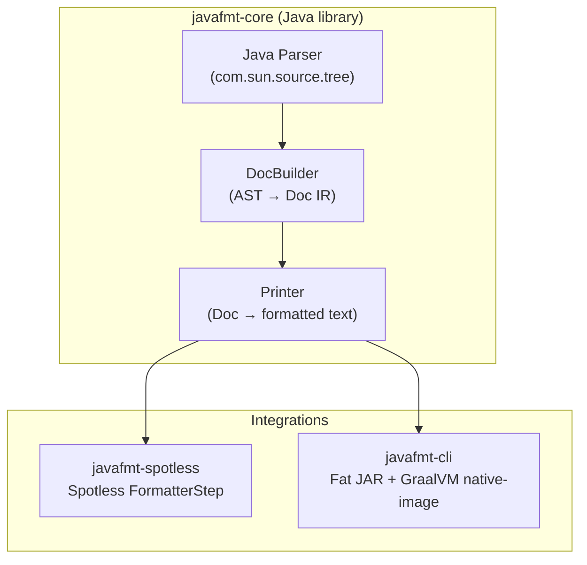
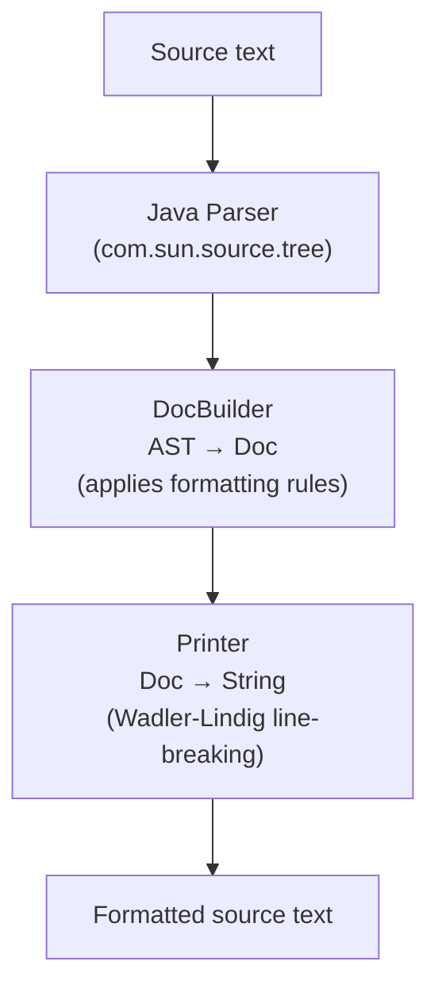

# javafmt — Design Plan

## Motivation

There are no decent code formatters for Java ([ref](https://jqno.nl/post/2024/08/24/why-are-there-no-decent-code-formatters-for-java/)). The main pain points with existing tools (google-java-format, palantir-java-format) are performance, inflexible style, and poor handling of modern Java constructs. This project aims to build a fast, opinionated Java formatter that integrates with [Spotless](https://github.com/diffplug/spotless) and optionally runs as a standalone CLI via GraalVM native-image.

## Goals

- **Fast** — format large codebases without being the bottleneck
- **Correct** — use Java's own parser (`com.sun.source.tree`) so new syntax is always supported
- **Opinionated** — zero-config by default, with configurability added over time
- **Targets Java 21+ LTS** (21, 25, future LTS releases)
- **Build-tool native** — first-class Spotless step (Gradle) and Maven plugin, so CI enforces formatting with no pre-installation
- **Standalone CLI** — fat JAR, with GraalVM native-image as a best-effort bonus

## Architecture




### Why this architecture?

- **Java's own parser** (`com.sun.source.tree` / `javac` internals) means we never lag behind on syntax. When a new Java LTS ships, we just update the JDK dependency.
- **Spotless integration** is a thin wrapper — Spotless already supports custom `FormatterStep` implementations, and since most Java projects use Gradle, this is the path of least resistance for adoption.
- **GraalVM native-image** is attempted as a best-effort standalone CLI. `com.sun.source.tree` uses service loading and reflection internally, so native-image may require reflection hints or a tracing agent. If it proves too painful, the fat JAR CLI (requiring a JVM) is the fallback — still fast, just needs Java installed.
- **Maven plugin** provides `javafmt:format` and `javafmt:check` goals. The plugin embeds `javafmt-core` as a dependency — users add it to their `pom.xml` and it just works. No pre-installation, no external tools. This is critical for the author's rubric: "anything not enforced by CI is merely a suggestion."
- **Shared core** means Spotless, Maven plugin, and CLI always produce identical output.

### Module structure

```
javafmt/
├── build.gradle.kts             # Root: shared config, version catalog
├── settings.gradle.kts          # Includes all subprojects
├── gradle/
│   └── libs.versions.toml       # Version catalog for all deps
├── buildSrc/
│   ├── build.gradle.kts
│   └── src/main/kotlin/
│       └── javafmt.java-conventions.gradle.kts  # Shared Java 21 + test config
│
├── javafmt-core/                  # Java library — parser + formatter engine
│   ├── build.gradle.kts
│   └── src/
│       ├── main/java/io/javafmt/
│       │   ├── Javafmt.java               # Public API: String format(String source)
│       │   ├── JavaParser.java          # Wraps com.sun.source.tree
│       │   ├── doc/                     # Parser-agnostic IR
│       │   │   ├── Doc.java             # Wadler-Lindig-style document algebra
│       │   │   ├── MemberGroup.java     # Member ordering buckets
│       │   │   └── LeadingCommentAttacher.java  # Comment-attachment interface
│       │   ├── builder/                 # AST → Doc translation (com.sun.source.tree)
│       │   │   ├── DocBuilder.java      # Pure dispatcher (AST → Doc)
│       │   │   ├── ExpressionRenderers.java  # Expression sub-renderers
│       │   │   ├── TypeRenderers.java   # Type and leaf node renderers
│       │   │   └── ...                  # Per-construct renderers (ClassLike, Record, Enum, …)
│       │   ├── printer/
│       │   │   └── Printer.java         # Doc → String (line-breaking algorithm)
│       │   ├── rules/                   # Formatting rules by construct
│       │   │   ├── ImportRule.java
│       │   │   ├── ClassRule.java
│       │   │   ├── MethodRule.java
│       │   │   ├── LambdaRule.java
│       │   │   ├── RecordRule.java
│       │   │   ├── EnumRule.java
│       │   │   ├── SwitchRule.java
│       │   │   └── ...
│       │   └── config/
│       │       └── JavafmtConfig.java     # Opinionated defaults
│       └── test/java/io/javafmt/         # Unit tests (TDD, AssertJ only)
│
├── javafmt-cli/                   # Standalone CLI
│   ├── build.gradle.kts         # Fat JAR + GraalVM native-image (best-effort)
│   └── src/main/java/io/javafmt/cli/
│       └── Main.java                    # stdin/stdout or file args
│
├── javafmt-spotless/              # Spotless integration
│   ├── build.gradle.kts
│   └── src/main/java/io/javafmt/spotless/
│       └── JavafmtFormatterStep.java
│
├── javafmt-maven-plugin/          # Maven plugin (format + check goals)
│   ├── build.gradle.kts         # Built by Gradle via org.gradlex.maven-plugin-development
│   └── src/main/java/io/javafmt/maven/
│       └── JavafmtMojo.java
│
├── javafmt-intellij/              # IntelliJ IDEA plugin (future)
│   ├── build.gradle.kts
│   └── src/main/java/io/javafmt/intellij/
│       └── JavafmtFormatterService.java
│
├── test-fixtures/               # Shared test cases (input → expected output)
│   ├── basic/
│   ├── lambdas/
│   ├── records/
│   ├── enums/
│   ├── switch-expressions/
│   └── imports/
│
└── DESIGN.md                    # This file
```

## Formatting Rules (v1 — Opinionated, Non-configurable)

### Style baseline and deviations

javafmt uses the [Google Java Style Guide](https://google.github.io/styleguide/javaguide.html) as its baseline. Where we deviate, the motivation is code-review ergonomics: keep diffs small and meaningful, make structure obvious at a glance, and eliminate entire categories of reviewer comments. This is the same philosophy behind tools like `prettier` and `rustfmt` — a slightly stricter style that nobody loves perfectly but everyone can live with, because the consistency pays off in review.

| Rule | Google | javafmt | Why we differ |
|------|--------|-------|---------------|
| **Line width** | 100 | 150 | Fewer arbitrary wraps means line-level diff changes reflect real changes, not reformatting. Modern monitors and side-by-side diff views handle 150 comfortably. |
| **Block indent** | 2 spaces | 4 spaces | Deeper visual hierarchy makes nesting obvious without counting spaces. 2-space collapses in wide diffs. |
| **Import order** | Static first, then non-static (one flat ASCII-sorted group each) | Same | — |
| **Member ordering** | Author's discretion ("logical order") | Strict: fields → constructors → public → protected → pkg-private → private → static. Exception: in a utility class (`final` class with no instance state), the private no-arg constructor is pinned to the bottom. | Reviewers always know where to look for the public API vs internals without reading the whole file. The utility-class exception keeps the uninstantiable-marker out of the way so the eye lands on real behavior first. |
| **Enum constants** | No sort requirement, trailing comma optional | Alphabetically sorted, trailing comma required | Adding a constant produces a clean 1-line diff with no comma-shuffling on the previous line. |
| **Brace enforcement** | Required, but missing braces isn't a build failure | Missing braces = build failure (lint, not auto-fix) | Eliminates the class of bugs where a stray `if` silently gains a second statement; reviewers don't have to verify brace scope. |
| **Annotations** | Fields: same line allowed; methods: own line unless single+no-args | Same as Google | — |
| **Javadoc / comments** | Required on all visible members; block-comment continuation lines reindented at layout time; IDE directives (`//noinspection`, `CHECKSTYLE:OFF`) preserved exactly | Parity with google-java-format: token-precise attachment, layout-time continuation reindent, directive safelist, verbatim content | javafmt matches google-java-format's industry-leading handling; this is a non-negotiable correctness bar, not a style choice. |
| **Method chains** | Not specified | Break before `.` if chain doesn't fit | — |
| **Records** | Not specified | One line if fits, else one component per line | — |

### Line width
- **150 characters** max line width

### Braces
- **K&R style** (opening brace on same line)
- **Always required** — even for single-statement `if`/`else`/`for`/`while`/`do-while`.
- **Safe rewrites.** javafmt applies a fixed set of semantics-preserving mechanical rewrites alongside formatting. Every rewrite emits a `Warning` diagnostic. Rewrites are not configurable. See the [Safe rewrites](#safe-rewrites) section below for the catalog.

### Safe rewrites (lint pass)

javafmt implements [Checkstyle](https://checkstyle.org/)'s rule catalog the way [ruff](https://docs.astral.sh/ruff/) implements pylint/flake8: for each check, ask "can this be auto-fixed safely?" and if yes, implement it as a lint edit; if no, emit a `Diagnostic.Warning` only. This gives you Checkstyle's comprehensive rule coverage in a single tool invocation, without the sharp edge of fixes that could silently change behavior.

Lint rules run *before* the formatter, in a fixed-point loop, and produce textual edits.

- **The formatter never breaks code.** A rule may only emit an edit when the rewrite is guaranteed to preserve compilation and behavior. If applying the edit would produce non-compiling source (e.g. adding `final` to a parameter the body reassigns), the rule emits a `Diagnostic.Warning` instead and leaves the source untouched. The developer fixes the underlying issue (introduce a local copy, an `AtomicInteger` holder, etc.) and re-runs javafmt, after which the safe edit applies. Javafmt has no `--unsafe-fixes` mode in v1; cases that aren't safe are *only* surfaced as warnings.
- **Edits are unconditional within their safety envelope.** Javafmt has no opt-in fixes — if the rule would fire, it fires.
- **Convergence is required.** Re-running a rule on its own output must produce zero edits. The lint engine iterates rules until no edits remain (with a hard cap), so a rule that flip-flops would be a bug.

#### Auto-fix rules

| Rule | Checkstyle check | What javafmt does |
|------|-----------------|-------------------|
| **NeedBraces** | `NeedBraces` | Add `{}` to braceless `if`/`else`/`for`/`while`/`do-while` bodies. |
| **FinalLocalVariable** | `FinalLocalVariable` | Add `final` to locals never reassigned. Reassigned locals: no warning (Checkstyle flags them; javafmt skips). |
| **FinalParameters** | `FinalParameters` | Add `final` to method/constructor parameters. Reassigned parameters: warning only (Checkstyle flags them; javafmt won't break compilation). |
| **ArrayTrailingComma** | `ArrayTrailingComma` | Add trailing comma to non-empty array initializers. Empty initializers (`{}`) are skipped. The formatter cooperates by emitting trailing commas in its array rendering, so the convention survives re-format cycles. |
| **LocalVarUseVar** | — | Replace declared type with `var` where the initializer's expression type exactly matches the declared type. |
| **DefaultComesLast** | `DefaultComesLast` | Move `default` to last position in arrow-form switches. For colon-form, only when `default` has its own terminating body and isn't part of a label group; otherwise warn. |
| **ModifierOrder** | `ModifierOrder` | Reorder modifiers to JLS order: `public protected private abstract default static final transient volatile synchronized native strictfp`. |
| **RedundantModifier** | `RedundantModifier` | Remove implied modifiers: `public abstract` on interface methods, `public static final` on interface fields, `static` on nested enum/record/interface declarations, `final` on private methods. |
| **ArrayTypeStyle** | `ArrayTypeStyle` | Rewrite C-style array declarations: `String args[]` → `String[] args`. |
| **UpperEll** | `UpperEll` | Rewrite lowercase-ell long literals: `1l` → `1L`. |
| **MultipleVariableDeclarations** | `MultipleVariableDeclarations` | Split `int a, b = 0;` into one declaration per line. |
| **UnusedImports** | `UnusedImports` | Remove imports not referenced anywhere in the compilation unit. |
| **EmptyStatement** | `EmptyStatement` | Remove lone `;` empty statements. |
| **OneStatementPerLine** | `OneStatementPerLine` | Split multiple statements on one line into separate lines. |
| **NewlineAtEndOfFile** | `NewlineAtEndOfFile` | Ensure the file ends with exactly one `\n`. |
| **ExplicitInitialization** | `ExplicitInitialization` | Remove explicit default initialization: `int x = 0;` → `int x;`, `Object o = null;` → `Object o;`, `boolean b = false;` → `boolean b;`. |

#### Warning-only rules

These Checkstyle checks detect real problems but cannot be auto-fixed without risking behavior change or compilation failure. javafmt emits a `Diagnostic.Warning` and leaves the source untouched.

| Rule | Checkstyle check | Why no auto-fix |
|------|-----------------|-----------------|
| **FallThrough** | `FallThrough` | Adding `break;` changes behavior in intentional fall-through. Accept intentional fall-through by adding a `// fallthrough` comment between cases. |
| **EqualsHashCode** | `EqualsHashCode` | Override both `equals` and `hashCode` or neither. Generating a correct `hashCode` requires knowing the class's identity fields — a semantic decision. |
| **MissingSwitchDefault** | `MissingSwitchDefault` | Switch statement without a `default` arm. What to put in the default block is a semantic decision. |
| **EmptyBlock** | `EmptyBlock` | Empty `catch`/`finally`/`else` blocks. Adding content requires intent; removing the block may change semantics. |
| **AvoidStarImport** | `AvoidStarImport` | Wildcard imports can resolve to multiple candidates; safely expanding them requires a full symbol resolver. |
| **HideUtilityClassConstructor** | `HideUtilityClassConstructor` | Utility class lacks a private no-arg constructor. Adding one is structurally safe, but reliable "utility class" detection without false positives requires type-level analysis. |
| **CovariantEquals** | `CovariantEquals` | `equals(MyType)` defined but doesn't override `equals(Object)`. Fixing this changes the method signature and may affect callers. |
| **StringLiteralEquality** | `StringLiteralEquality` | `==` used to compare string references. Safe substitution (`str.equals(other)`) requires confirming the operand type is `String`, which needs a type resolver. |

#### Out-of-scope checks

Detection-only checks with no plausible safe auto-fix — complexity metrics (`CyclomaticComplexity`, `NPathComplexity`), naming conventions (`MethodName`, `TypeName`), magic-number detection, API restriction checks — are out of scope for the lint pass. Projects that need them can run Checkstyle separately alongside javafmt.

#### Oracle TDD for lint rules

Each lint rule is validated against an independent oracle — typically the corresponding [Checkstyle](https://checkstyle.org/) check — using a differential test. The pattern:

1. **Write the oracle test first (red).** Add a corpus of small Java files exercising the rule under `javafmt-core/src/oracleTest/resources/corpus/<rule-name>/` and a `<Rule>OracleTest` that, for each corpus file, formats it through javafmt and asserts that Checkstyle's equivalent check reports zero violations on the output. A second assertion (`assertCorpusExercisesRule`) requires that at least one corpus file has Checkstyle violations *before* javafmt processes it — without this, soundness passes vacuously on a corpus of already-clean files.
2. **Write a unit fixture (red).** Add an `input.java` / `expected.java` pair under `test-fixtures/lint-<rule>/` to pin the exact behavior of one canonical case.
3. **Implement the rule (green).** Implement `LintRule.apply` to make both tests pass.
4. **Refactor (clean).**

Where Checkstyle and javafmt disagree by design — for instance, Checkstyle's `FinalParametersCheck` flags reassigned parameters too (and expects the developer to refactor), but javafmt refuses to break compilation and emits a warning instead — the divergence is documented in the rule's Javadoc and the corpus / oracle config reflects it. The oracle keeps javafmt honest about *what* it claims to fix; the divergence comments make explicit *where* javafmt chooses a different policy.

### Single-line constructs
- `if (condition) { doSomething(); }` — allowed on one line if it fits within 150 chars
- Records with all fields fitting on one line stay on one line
- Short lambdas can be inline: `list.stream().map(x -> x.name())`

### Lambdas
- Multi-line lambdas get their own lines:
  ```java
  list.stream()
      .filter(item -> {
          return item.isValid();
      })
      .map(item -> item.name())
      .toList();
  ```
- Lambda body indented relative to the enclosing method chain, not the lambda arrow

### Method chains
- If a chain doesn't fit on one line, break before each `.`
- Indent continuation by 4 spaces

### Imports
- Static imports first (ASCII sort), blank line, then all non-static imports (ASCII sort) — one flat group, no splitting by origin (`java.*`, `javax.*`, third-party are not separated)
- No wildcard imports — if the formatter encounters `import foo.*`, leave it but emit a warning

### Member ordering within a class
- Fields (public → protected → package-private → private)
- Constructors
- Public methods
- Protected methods
- Package-private methods
- Private methods
- Static methods (at the bottom)
- Within each group: declaration order preserved (don't re-sort)
- **Utility classes** (a `final` class with no instance state, whose only constructor is a `private` no-arg constructor used solely to suppress instantiation): the private constructor is pinned to the **very bottom** of the class, after all methods. It is an uninstantiable-marker, not meaningful behavior, and belongs out of the way so readers land on the real API first.

### Enums
- Enum constants sorted **alphabetically**
- Trailing comma after last constant
- If all constants fit on one line (within 150 chars), keep them on one line
- Otherwise, one constant per line

### Records
- If the full record declaration fits on one line (within 150 chars), keep it on one line:
  ```java
  public record Point(int x, int y) {}
  ```
- Otherwise, one component per line:
  ```java
  public record VeryDetailedRecord(
      String firstName,
      String lastName,
      LocalDate dateOfBirth,
      Optional<String> middleName) {}
  ```

### Switch expressions
- Cases aligned, arrow-style preferred:
  ```java
  return switch (status) {
      case ACTIVE -> handleActive();
      case INACTIVE -> handleInactive();
      case PENDING -> {
          log.info("pending");
          yield handlePending();
      }
  };
  ```

### Annotations
Follows Google Java Style annotation placement rules:
- **Fields**: annotations are inline before the modifiers, space-separated (parameterized annotations allowed):
  ```java
  @Getter @Setter private int age = 10;
  @SuppressWarnings("unchecked") private List<?> items;
  ```
- **Methods**: each annotation on its own line above the signature, *except* a single parameterless annotation may share the first line:
  ```java
  @Override public String toString() { ... }   // single + no args: inline

  @SuppressWarnings("all")
  void process() { ... }                        // parameterized: own line

  @Deprecated
  @Override
  void old() { ... }                            // multiple: each own line
  ```

### Javadoc / comments

The standard to beat is google-java-format. Its comment handling is industry-leading: token-precise attachment, layout-time reindentation, and principled handling of IDE/tool directives. javafmt targets parity.

- **Preserved verbatim** — every `//`, `/* */`, and `/** */` in the input appears in the output with its original text intact. No re-wrapping, no `*`-alignment changes, no stripping of the comment's own content. (Javadoc reflow is a v2 candidate, explicitly out of scope for v1.)
- **Token-precise attachment.** Comments attach to source *tokens*, not AST nodes. A comment between `else` and `if`, between two annotation lines, between `,` and the next argument, between `<` and a type parameter, or between `)` and `throws` lands at the right place without requiring a bespoke attacher case per AST shape. This matches google-java-format's `JavaInput.Token#getToksBefore()` / `getToksAfter()` model and is the precondition for "every position" actually meaning every position.
- **All positions are covered**: file-header comments above `package`, leading comments on declarations (class/interface/enum/record/method/constructor/field/init block/enum constant), comments on imports, comments between statements, trailing same-line comments (`int x = 1; // note`), comments inside argument and parameter lists, comments inside empty blocks (`{ /* note */ }`), and comments between the last statement of a block and its closing brace.
- **Layout-time reindentation.** Continuation lines of multi-line block comments are re-indented to the comment's *final* output column, not its source column — so alignment is preserved when the enclosing declaration moves under formatting. This is resolved in the printer after layout decisions are made, not at `Doc` construction.
- **Directive safelist.** IDE and tooling directives are preserved byte-for-byte with no reindent and no width-sensitive decisions: `// noinspection …`, `// CHECKSTYLE:OFF|ON`, `// SUPPRESS CHECKSTYLE …`, `// @formatter:off|on`, `// NOPMD`, `// $NON-NLS-…$`, and their block-comment equivalents. (This is separate from javafmt's own on/off directives, which *control* formatting rather than protect a specific comment.)
- **String / text-block safety.** The scanner recognises `//` and `/*` only outside string literals, character literals, and text blocks. `//` inside a `String` or `"""…"""` is never treated as a comment.

### Blank lines
- One blank line between methods
- One blank line between field groups (when visibility changes)
- No blank line after opening brace of class/method
- No blank line before closing brace
- No more than one consecutive blank line anywhere (collapse extras)

### Indentation
- 4 spaces (no tabs)
- Continuation indent: 4 spaces

## Intermediate Representation: Doc Algebra

The core formatting engine uses a **Wadler-Lindig document algebra** (the same approach used by Prettier, rustfmt, and dprint-plugin-typescript). This is the key to making formatting fast and correct.

### Doc primitives

| Doc node     | Meaning |
|-------------|---------|
| `Text(s)`   | Literal string, never broken |
| `Line`      | Line break, or space if flattened |
| `SoftLine`  | Line break, or nothing if flattened |
| `HardLine`  | Always a line break |
| `Indent(d)` | Increase indent for contents |
| `Group(d)`  | Try to flatten on one line; if it doesn't fit, break |
| `Concat(ds)`| Sequence of docs |
| `IfBreak(b,f)` | Use `b` if group breaks, `f` if flat |

### Formatting pipeline



The Wadler-Lindig algorithm runs in **O(n)** time with the line width as a constant factor — this is what makes Prettier-style formatters fast. Combined with Java's own parser (which is heavily optimized), formatting should be competitive with or faster than google-java-format.

## Implementation Phases

### Phase 1: Core Library — Parser + Printer (MVP)

**Goal:** Format a single `.java` file from stdin to stdout.

1. Set up Gradle multi-module project (Java 21, Gradle 8.x)
2. Implement `JavaParser` wrapper around `com.sun.source.tree`
3. Implement `Doc` algebra (sealed interface with record variants — great use of modern Java)
4. Implement `Printer` (Wadler-Lindig algorithm)
5. Implement `DocBuilder` with rules for:
   - Package declaration
   - Import statements (sorting + grouping)
   - Class/interface/enum/record declarations
   - Fields and methods
   - Basic statements (if, for, while, try, switch)
   - Expressions (method calls, chains, lambdas, ternary)
6. Implement member ordering (reorder by visibility)
7. Implement brace-enforcement lint check
8. Build test fixture suite (input/expected pairs)
9. CLI entry point: `java -jar javafmt.jar < Input.java > Output.java`

### Phase 2: Spotless Integration

**Goal:** Use the formatter in any Gradle project via Spotless.

1. Implement `FormatterStep` that calls the core library
2. Publish to Maven Local (then Maven Central)
3. Usage:
   ```kotlin
   // build.gradle.kts
   spotless {
       java {
           custom("javafmt") {
               io.javafmt.Javafmt.format(it)
           }
       }
   }
   ```
4. **Dogfood:** wire `javafmt-spotless` into the javafmt monorepo's own build as a composite build, so every `gradle build` formats javafmt's own sources with its just-compiled output. Keep an escape hatch (`-x spotlessCheck`) for the case where javafmt breaks its own formatting. Until `Javafmt.format` does something real, this step is a no-op that validates the wiring.

### Phase 3: Maven Plugin

**Goal:** Use the formatter in any Maven project, enforced by CI.

1. Build `javafmt-maven-plugin` with two goals:
   - `javafmt:format` — reformat source files in-place
   - `javafmt:check` — fail the build if any file isn't formatted (for CI)
2. Plugin embeds `javafmt-core` — no external installation needed
3. Publish to Maven Central alongside the core jar
4. Usage:
   ```xml
   <plugin>
       <groupId>io.javafmt</groupId>
       <artifactId>javafmt-maven-plugin</artifactId>
       <version>0.1.0</version>
       <executions>
           <execution>
               <goals>
                   <goal>check</goal>
               </goals>
           </execution>
       </executions>
   </plugin>
   ```

### Phase 4: GraalVM Native CLI

**Goal:** Zero-dependency standalone binary for CI and non-Gradle workflows.

1. Add GraalVM native-image Gradle plugin to `javafmt-cli`
2. Run tracing agent against the test suite to generate reflection/resource hints
3. Build and test native binary on Linux, macOS, Windows (GitHub Actions matrix)
4. If native-image can't handle `com.sun.source.tree`: document the limitation, ship fat JAR only

### Phase 5: Configurability

**Goal:** Allow users to override opinionated defaults.

- Line width (default: 150)
- Import grouping order
- Member ordering rules
- Single-line threshold behaviors
- Configuration via `.javafmt.toml` or Spotless config

### Phase 6: Performance & Polish

- Parallel file formatting (thread pool)
- Incremental formatting (only changed files — ratcheting)
- IDE plugins (IntelliJ, VS Code)
- Range formatting (format selection only)

## Code Style (for the formatter itself)

The formatter's own codebase should be a showcase of modern Java:

- **`final var`** for all local variables — no raw types, no `var` without `final`
- **Sealed interfaces + records** for all data types (Doc algebra, AST wrappers, config, errors)
- **Immutability everywhere** — records are immutable by default; collections via `List.of()`, `Map.of()`, `Set.of()`, `Collections.unmodifiable*()`
- **Pattern matching** in switch expressions for AST visitor dispatch
- **No nulls** — `Optional<T>` at API boundaries, `Objects.requireNonNull` at internal boundaries
- **Text blocks** for multi-line strings in tests
- **Stream API** where it reads cleanly (don't force it for simple loops)
- **No checked exceptions** in public API — wrap in unchecked `FormatterException`

Example of the Doc algebra:

```java
public sealed interface Doc
        permits Doc.Text, Doc.Line, Doc.SoftLine, Doc.HardLine,
                Doc.Indent, Doc.Group, Doc.Concat, Doc.IfBreak {

    record Text(String value) implements Doc {}
    record Line() implements Doc {}
    record SoftLine() implements Doc {}
    record HardLine() implements Doc {}
    record Indent(Doc contents) implements Doc {}
    record Group(Doc contents) implements Doc {}
    record Concat(List<Doc> parts) implements Doc {}
    record IfBreak(Doc breakContents, Doc flatContents) implements Doc {}
}
```

Example of pattern matching in the printer:

```java
private int printDoc(final Doc doc, final int indent, final boolean flat) {
    return switch (doc) {
        case Doc.Text(final var value) -> {
            output.append(value);
            yield currentColumn + value.length();
        }
        case Doc.HardLine() -> {
            output.append('\n').append(" ".repeat(indent));
            yield indent;
        }
        case Doc.Group(final var contents) -> {
            final var flatResult = tryFlat(contents, indent);
            yield flatResult.isPresent()
                    ? flatResult.get()
                    : printDoc(contents, indent, false);
        }
        // ...
    };
}
```

## Code Quality & Testing

### TDD — Test-Driven Development

All code is written test-first. The cycle is:

1. Write a failing test (red)
2. Write the minimum code to make it pass (green)
3. Refactor (clean)

No production code is written without a failing test that motivates it. This is non-negotiable.

### Assertion library

- **AssertJ only** — never use JUnit's `assertEquals`, `assertTrue`, etc.
- All assertions use AssertJ's fluent API: `assertThat(result).isEqualTo(expected)`
- This applies everywhere: unit tests, integration tests, fixture-based tests

### Test structure

- **Fixture-based tests** for formatting rules: each rule has a directory of `input.java` / `expected.java` pairs under `test-fixtures/`. A parameterized test runner loads all fixtures and asserts `assertThat(Javafmt.format(input)).isEqualTo(expected)`.
- **Unit tests** for Doc algebra and Printer: test Doc construction and rendering in isolation.
- **Property-based tests** (future): formatted output should always parse without errors, formatting should be idempotent (`format(format(x)) == format(x)`).

### Gradle monorepo structure

The project is a Gradle multi-module monorepo with shared build configuration:

```
javafmt/
├── build.gradle.kts             # Root: shared dependency versions, common config
├── settings.gradle.kts          # Includes all subprojects
├── gradle/
│   └── libs.versions.toml       # Version catalog (single source of truth for deps)
├── buildSrc/                    # Shared build conventions
│   └── src/main/kotlin/
│       └── javafmt.java-conventions.gradle.kts  # Java 21, AssertJ, JUnit 5, etc.
│
├── javafmt-core/                  # Formatter engine (zero external deps at runtime)
├── javafmt-cli/                   # Standalone CLI (fat JAR + native-image)
├── javafmt-spotless/              # Spotless FormatterStep
├── javafmt-maven-plugin/          # Maven plugin (format + check goals, built by Gradle)
├── javafmt-intellij/              # IntelliJ plugin (future)
└── test-fixtures/               # Shared input/expected pairs
```

The `javafmt.java-conventions` plugin in `buildSrc` applies to every submodule and configures:

- Java 21 toolchain
- JUnit 5 test framework
- AssertJ as the only assertion library
- Common compiler flags (`-Werror`, `--enable-preview` if needed)
- Consistent formatting (javafmt formats itself — dogfooding)

Each integration module (`javafmt-spotless`, `javafmt-cli`, `javafmt-intellij`) depends on `javafmt-core` and adds only its thin wrapper + integration-specific tests.

### Dependency management

- **Version catalog** (`gradle/libs.versions.toml`) is the single source of truth for all dependency versions
- `javafmt-core` should have **zero runtime dependencies** — only the JDK. Test dependencies (JUnit 5, AssertJ) are the exception.
- Integration modules add only the dependencies they need (e.g., `javafmt-spotless` depends on Spotless API, `javafmt-intellij` depends on IntelliJ Platform SDK)

## Technology Choices

| Concern | Choice | Rationale |
|---------|--------|-----------|
| Language | Java 21+ | Dogfooding, access to `com.sun.source.tree` |
| Build tool | Gradle (Kotlin DSL) | Standard for Java, Spotless integration |
| Parser | `com.sun.source.tree` | Always up-to-date with JDK, zero dependencies |
| Doc algebra | Custom (sealed interfaces + records) | Lightweight, no deps, modern Java showcase |
| Native binary | GraalVM native-image (best-effort) | Fast startup, no JVM needed — fallback to fat JAR |
| Testing | JUnit 5 + fixture files | Input/expected pairs are easy to maintain |
| CI | GitHub Actions | GraalVM builds for Linux/macOS/Windows |

## Open Questions

1. **Enum sorting** — alphabetical sort could break code if enum constants reference each other (e.g., `A(B)` where `B` is defined later). Should we detect and skip sorting in those cases, or always sort and let the compiler catch it?
2. **Member reordering** — similarly, reordering methods could break forward references in field initializers. Need to handle this carefully or make it opt-in.
3. **GraalVM native-image** — `com.sun.source.tree` uses service loading internally. Will need to test and configure reflection/resource hints for native-image. If this proves too painful, the CLI ships as a fat JAR instead (requires JVM at runtime).
4. **Error recovery** — what should the formatter do with syntactically invalid Java? Options: return input unchanged, return partial formatting, or error. Leaning toward: return input unchanged + warning.

## Rubric Comparison

Evaluated against the criteria from [Why are there no decent code formatters for Java?](https://jqno.nl/post/2024/08/24/why-are-there-no-decent-code-formatters-for-java/):

| Criterion | Best existing | javafmt target | How we get there |
|-----------|--------------|-------------|-----------------|
| **Maven integration** | Good (all via Spotless/fmt-maven) | **Excellent** | Native `javafmt-maven-plugin` with `javafmt:check` and `javafmt:format` goals. Add to `pom.xml`, done. No pre-installation. |
| **Speed** | Excellent (google-java-format CLI) | **Excellent** | O(n) Wadler-Lindig printer. Fat JAR CLI + GraalVM native-image for ~10ms cold start. No Node.js, no Eclipse runtime. |
| **Formatting quality** | Excellent (google-java-format, Prettier Java) | **Excellent** | Wadler-Lindig Doc algebra (same approach as Prettier) ensures consistent, predictable line-breaking. |
| **Ergonomics** | Excellent (google-java-format) | **Excellent** | Zero-config opinionated defaults. No XML config exports, no IDE required for setup, no version instability. Stable formatting across versions (same input = same output). |
| **IntelliJ plugin** | Excellent (IntelliJ built-in) | **Good** | `javafmt-intellij` module planned. Delegates to `javafmt-core` so formatting matches CI exactly. |
| **Configuration** | Many (IntelliJ, Eclipse) | **Intentionally minimal** | Opinionated by design. Configurability added incrementally in Phase 5 for the options that matter most. |

### How we avoid the specific complaints from the article

- **"Anything not enforced by CI is merely a suggestion"** — Both Gradle (Spotless) and Maven (`javafmt:check`) can fail the build.
- **"Maven is too slow for a format-on-save workflow"** — The CLI (fat JAR or native binary) is the fast path for editors/LSP. Maven/Gradle are for CI enforcement.
- **"Formatting isn't stable between versions"** — We treat formatting output as a contract. Formatting changes between versions are breaking changes and get major version bumps.
- **"Requires a full NodeJS runtime"** — Pure Java, zero external runtime dependencies.
- **"Requires the IDE to configure"** — Zero-config. No XML files to export.
- **"No proper standalone tool"** — `javafmt-cli` works standalone from day one (Phase 1).
